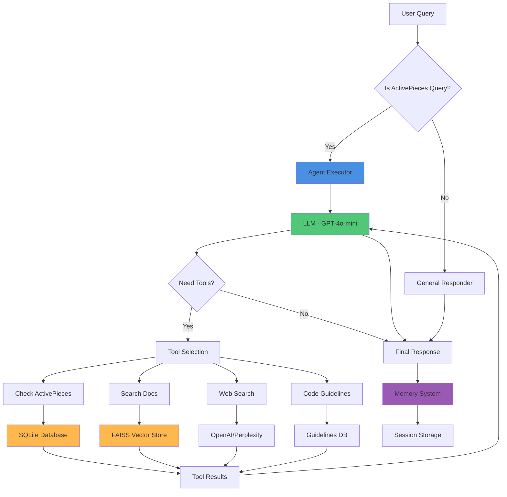

# Agent Architecture

## Overview
The Agent is a fast, intelligent assistant that answers questions about ActivePieces using a tool-calling approach with conversation memory.

## What It Does
- Answers questions about ActivePieces pieces, actions, and triggers
- Searches the knowledge base for detailed information
- Uses web search for general questions
- Maintains conversation history across sessions
- Provides complete configuration details for workflows

## Architecture Diagram



## Flow Explanation

### 1. Query Classification (Fast)
- Determines if query is about ActivePieces or general
- Uses recent conversation history for context
- General queries skip the agent entirely

### 2. Agent Processing
- **LLM Brain**: GPT-4o-mini decides what tools to use
- **Tool Execution**: Runs 1-3 tools in parallel when possible
- **Iterative**: Can call tools multiple times if needed

### 3. Available Tools
1. **Check ActivePieces** - Verifies if pieces/actions exist (SQLite)
2. **Search Docs** - Finds detailed info with full properties (FAISS)
3. **Web Search** - Gets external information when needed
4. **Code Guidelines** - Retrieves TypeScript code templates

### 4. Memory System
- Stores conversations by session ID
- Loads history on startup
- Enables context-aware multi-turn conversations

### 5. Response Delivery
- Streams status updates to frontend
- Shows which tools are being used
- Delivers final comprehensive answer

## Key Components

| Component | Technology | Purpose |
|-----------|-----------|---------|
| **Agent Executor** | LangChain | Orchestrates LLM + tools |
| **LLM** | GPT-4o-mini | Decision-making and reasoning |
| **Database** | SQLite + FTS5 | Fast piece/action/trigger lookup |
| **Vector Store** | FAISS | Semantic search for documentation |
| **Memory** | JSON Files | Conversation history per session |

## Performance Characteristics
- **Speed**: 1-3 seconds for simple queries
- **Accuracy**: 450 pieces, 2,890 actions, 834 triggers
- **Context**: Up to 8 recent messages for history
- **Max Iterations**: 60 tool calls max (prevents loops)
- **Timeout**: 120 seconds per query

## Usage Pattern
```
User: "How do I send a Slack message?"
  ↓
Query Classification: ActivePieces query ✓
  ↓
Agent: Uses "Search Docs" tool
  ↓
Tool: Finds Slack piece with "Send Message" action
  ↓
Tool: Returns ALL input properties
  ↓
Agent: Formats comprehensive answer with examples
  ↓
Memory: Saves to session history
  ↓
Response: Complete guide with all fields
```

## When to Use
- Quick questions about specific pieces
- Looking up action/trigger properties
- Troubleshooting configurations
- Understanding how integrations work
- Multi-turn conversations needing context

---

**Created**: For understanding the core agent system
**Related**: See `FLOW_BUILDER_ARCHITECTURE.md` for flow building mode

