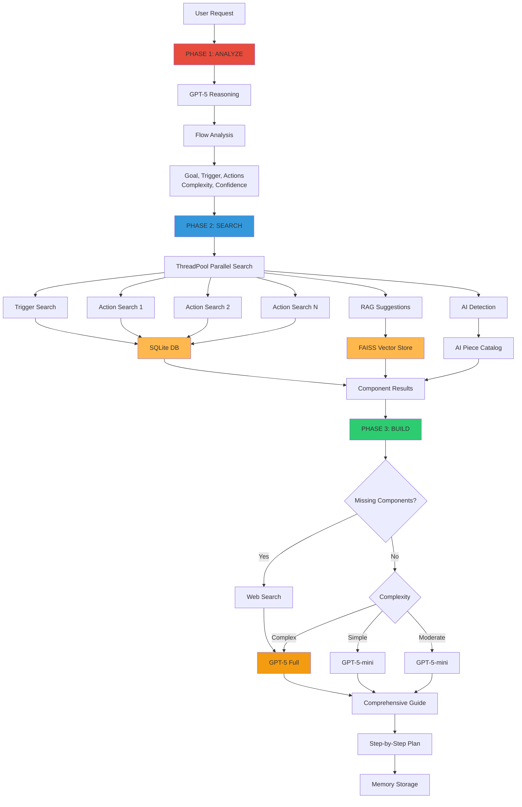

# Flow Builder Architecture

## Overview
The Flow Builder is a specialized 3-phase system that creates comprehensive, step-by-step guides for building complete ActivePieces workflows. It uses GPT-5 for advanced reasoning.

## What It Does
- Analyzes complex workflow requests
- Searches for all required pieces in parallel
- Generates detailed implementation guides
- Handles missing components intelligently
- Creates production-ready workflow documentation

## Architecture Diagram



## Three-Phase Process

### Phase 1: ANALYZE (2-3 seconds)
**Goal**: Understand what the user wants to build

**Process**:
1. GPT-5-mini analyzes the request
2. Identifies trigger type (what starts the flow)
3. Lists all needed actions (what happens)
4. Determines clarity and complexity
5. Flags missing information

**Output**:
```json
{
  "flow_goal": "Send email when new file added to Drive",
  "trigger_type": "Google Drive - New File",
  "actions_needed": ["Send Email"],
  "complexity": "simple",
  "confidence": "high"
}
```

### Phase 2: SEARCH (3-5 seconds)
**Goal**: Find all required pieces in the database

**Process**:
1. **Parallel Search**: Uses ThreadPoolExecutor (8 workers)
   - Trigger piece lookup
   - Multiple action searches simultaneously
   - RAG suggestions from vector store
   - AI piece detection (Text AI, Image AI, etc.)

2. **Smart Matching**:
   - Generates multiple search terms per component
   - Caches results to avoid duplicate queries
   - Prioritizes native ActivePieces AI utilities
   - Provides fallback alternatives

3. **Input Properties**:
   - Fetches ALL input fields for found actions
   - Includes required/optional status
   - Gets descriptions and data types

**Output**:
- Trigger piece + available triggers
- Action pieces + specific actions + inputs
- Alternative pieces if exact match not found
- Knowledge base suggestions
- HTTP/Code fallback options

### Phase 3: BUILD (10-30 seconds)
**Goal**: Generate comprehensive step-by-step guide

**Model Selection** (Adaptive):
- **Simple + High Confidence**: GPT-5-mini (faster)
- **Complex OR Missing Components**: GPT-5 (smarter)
- **Moderate**: GPT-5-mini with higher reasoning

**Process**:
1. Builds context package with:
   - Flow analysis from Phase 1
   - All found components from Phase 2
   - Piece overviews (actions/triggers)
   - Input property references
   - HTTP/Code fallback docs if needed
   - RAG suggestions

2. GPT-5 generates guide with:
   - Flow overview
   - Prerequisites
   - Step-by-step trigger configuration
   - Detailed action configurations
   - ALL input properties explained
   - Testing instructions
   - Troubleshooting tips
   - Pro tips and optimizations

**Output**: 2,000-5,000 word markdown guide

## Key Features

### 1. AI-First Detection
Automatically detects AI tasks and recommends native pieces:
- **Text AI** → OpenAI GPT-4/5, Claude, Gemini
- **Image AI** → Image generation
- **Video AI** → Video generation
- **Utility AI** → Extract data, classify, moderate

### 2. Parallel Component Search
Uses ThreadPoolExecutor for simultaneous lookups:
```python
with ThreadPoolExecutor(max_workers=8):
    # Search trigger, all actions, RAG, AI simultaneously
    futures = {
        ("trigger", term): executor.submit(find_trigger),
        ("action1", term): executor.submit(find_action),
        ("action2", term): executor.submit(find_action),
        # ... more parallel searches
    }
```

### 3. Strategy Selection
For each action, determines:
- **Native**: Use exact ActivePieces piece
- **Alternative**: Similar piece available
- **RAG**: Suggestions from knowledge base
- **Custom**: HTTP Request or Code needed

### 4. Fallback Intelligence
When piece not found:
1. Check RAG suggestions
2. Provide HTTP Request guidance
3. Include code template guidelines
4. Search web for latest docs

### 5. Context Awareness
Includes conversation history:
- Loads last 8 messages from session
- Understands follow-up requests
- Provides updated/additional guides

## Performance Characteristics

| Metric | Value | Notes |
|--------|-------|-------|
| **Total Time** | 15-40 seconds | Depends on complexity |
| **Phase 1** | 2-3 seconds | Analysis |
| **Phase 2** | 3-5 seconds | Parallel search |
| **Phase 3** | 10-30 seconds | Guide generation |
| **Database Queries** | 10-20 | Cached, parallel |
| **Output Length** | 2,000-5,000 words | Comprehensive |

## Fast Mode
Set `FLOW_BUILDER_FAST_MODE=true` for:
- Lower reasoning effort
- Fewer knowledge base searches
- Faster but less detailed guides
- Good for simple flows

## Usage Pattern

```
User: "Build a flow that posts new Slack messages to Twitter"
  ↓
Phase 1: Analyze
  - Goal: Post Slack messages to Twitter
  - Trigger: Slack - New Message
  - Actions: [Post to Twitter]
  - Complexity: Moderate
  ↓
Phase 2: Search (Parallel)
  - Find Slack piece ✓
  - Find Twitter piece ✓
  - Get "New Message" trigger ✓
  - Get "Create Tweet" action ✓
  - Fetch all input properties ✓
  ↓
Phase 3: Build
  - Model: GPT-5-mini
  - Generate 3,000-word guide
  - Include all configuration details
  ↓
Output: Complete step-by-step guide with:
  ✓ Slack trigger setup
  ✓ Twitter action setup
  ✓ Data mapping examples
  ✓ Testing instructions
  ✓ Troubleshooting tips
```

## Comparison: Agent vs Flow Builder

| Feature | Agent | Flow Builder |
|---------|-------|--------------|
| **Purpose** | Answer questions | Build complete flows |
| **Model** | GPT-4o-mini | GPT-5-mini/GPT-5 |
| **Speed** | 1-3 seconds | 15-40 seconds |
| **Output** | Short answer | Detailed guide |
| **Database Access** | 1-3 tools | 10-20 parallel queries |
| **Use Case** | Quick lookups | Complex workflows |
| **Phases** | Single pass | 3-phase analysis |

## When to Use Flow Builder
- Building complete workflows from scratch
- Need step-by-step implementation guide
- Multiple pieces/actions required
- Want all configuration details
- Complex multi-step automation
- Production-ready documentation

## When to Use Regular Agent
- Quick questions about one piece
- Looking up specific properties
- Understanding how something works
- Troubleshooting single issue
- Need fast response

---

**Created**: For understanding the flow builder system
**Related**: See `AGENT_ARCHITECTURE.md` for quick query mode

